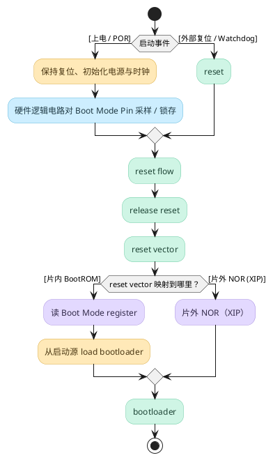

# from power-on to bootloader

> [!Note]
> 这篇文档描述的是通用 SoC 启动流程

从上电到首阶段启动代码的典型路径。不同 SoC/MCU 的复位向量映射与启动介质处理方式不同：

## 说明

| 阶段                   | comment                                                                                                                        |
| -------------------- | ------------------------------------------------------------------------------------------------------------------------------ |
| 启动事件                 | 上电触发的 POR，或外部复位、Watchdog 等复位事件                                                                                                 |
| 保持复位、初始化电源与时钟        | 在电源、时钟等达到要求前保持 SoC 复位；由复位逻辑电路完成必要初始化。                                                                                          |
| 采样 / 锁存 Boot Mode    | [[2_boot_mode_pin]]                                                                                                            |
| reset                | 外部复位或 Watchdog 等事件使 SoC 进入复位状态。                                                                                                |
| reset flow           | [[3_power-on_reset_POR_procedure]]                                                                                             |
| release reset        | CPU 退出复位状态，随后从 reset vector 指定的复位入口开始取指。                                                                                       |
| reset vector         | [[4_reset_vector]]                                                                                                             |
| 外部 NOR（XIP）          | [[2_what_is_xip]]。CPU 可直接从该映射区域取指并执行启动代码。                                                                                      |
| 读 Boot Mode register | [[5_bootrom]]。BootROM 读 Boot Mode register，决定从哪个启动源加载 image。                                                                   |
| 从启动源 load bootloader | eMMC、SD、NOR、NAND、SPI、UART/USB 等。这里的 NOR 是通过控制器读取存在 NOR 上的 image，加载到 SRAM/DRAM 后跳转执行，不要求 SoC 支持 XIP 。                           |

## 参见

- [[7_from_rcw_to_kernel_ARM]]
- [[0_深入理解SoC上电和boot流程]]
